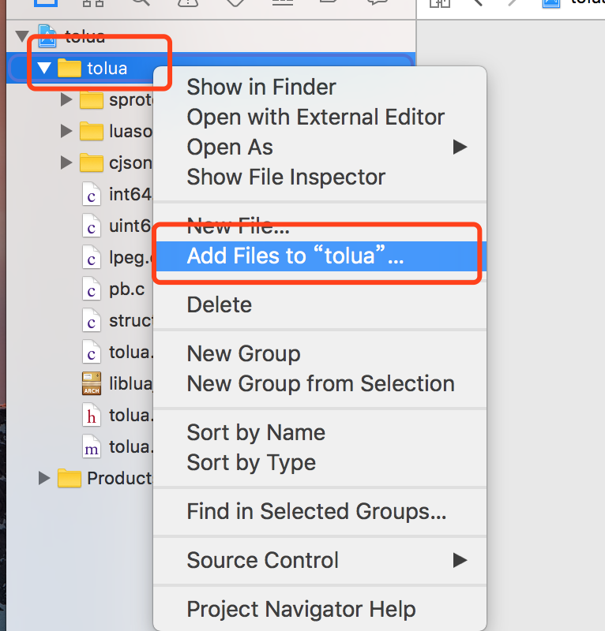
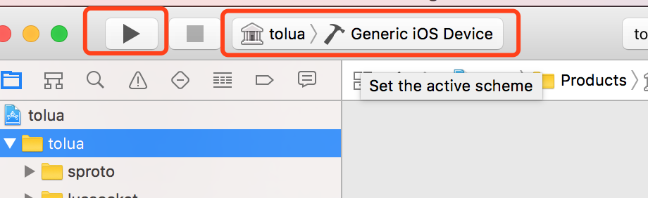

## tolua_runtime
**Build** 
pc: build_win32.sh build_win64.h  (mingw + luajit2.0.4)  
android: build_arm.sh build_x86.sh (mingw + luajit2.0.4)  
mac: build_osx.sh (xcode + luac5.1.5 luajit can't run in unity5)  
ios: build_ios.sh (xcode + luajit2.1 beta)  

NDK 版本:android-ndk-r10e 默认安装到 D:/android-ndk-r10e 
https://dl.google.com/android/repository/android-ndk-r10e-windows-x86_64.zip 
Msys2配置说明 
https://github.com/topameng/tolua_runtime/wiki 
配置好的Msys2下载 
https://pan.baidu.com/s/1c2JzvDQ 

## Libs
**cjson** 
https://github.com/mpx/lua-cjson 
**protoc-gen-lua** 
https://github.com/topameng/protoc-gen-lua 
**LuaSocket**  
https://github.com/diegonehab/luasocket 
**struct** 
http://www.inf.puc-rio.br/~roberto/struct/ 
**lpeg** 
http://www.inf.puc-rio.br/~roberto/lpeg/lpeg.html

## iOS 版本添加拓展包并打包流程

- 将你需要添加的拓展包的 C 代码文件夹（如 cjson、sproto）放在项目要目录下

- 使用 mac 操作系统 ，进入 iOS 目录

- 确保已经装了 xcode 的情况下，双击 tolua.xcodeproj

- 选择 tolua 目录，并右键，选择 “Add Files to tolua”

- 选择你要添加的库

- 最后选择 Generic iOS Device ，并点击左边的 三角形运行即可

